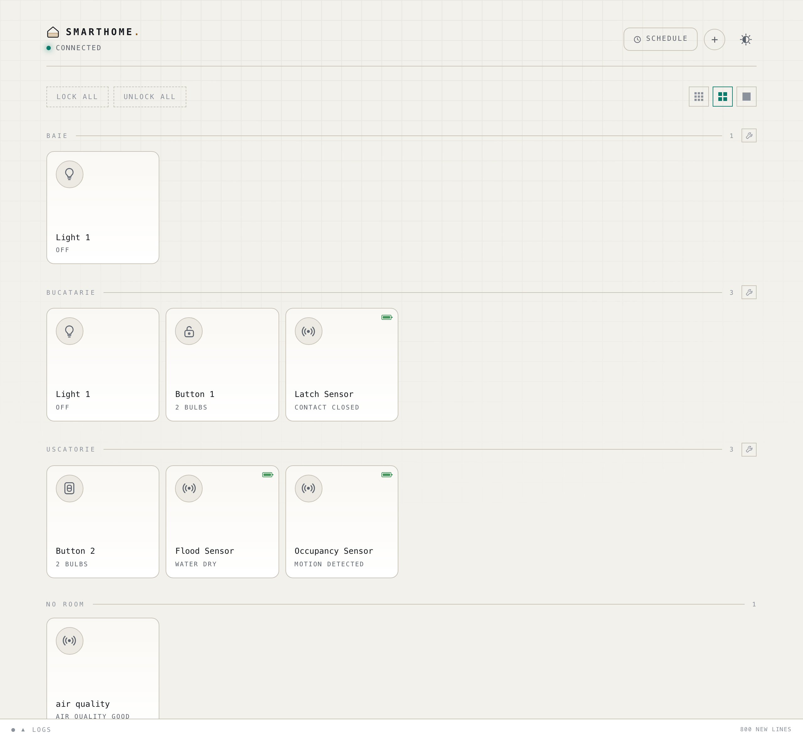
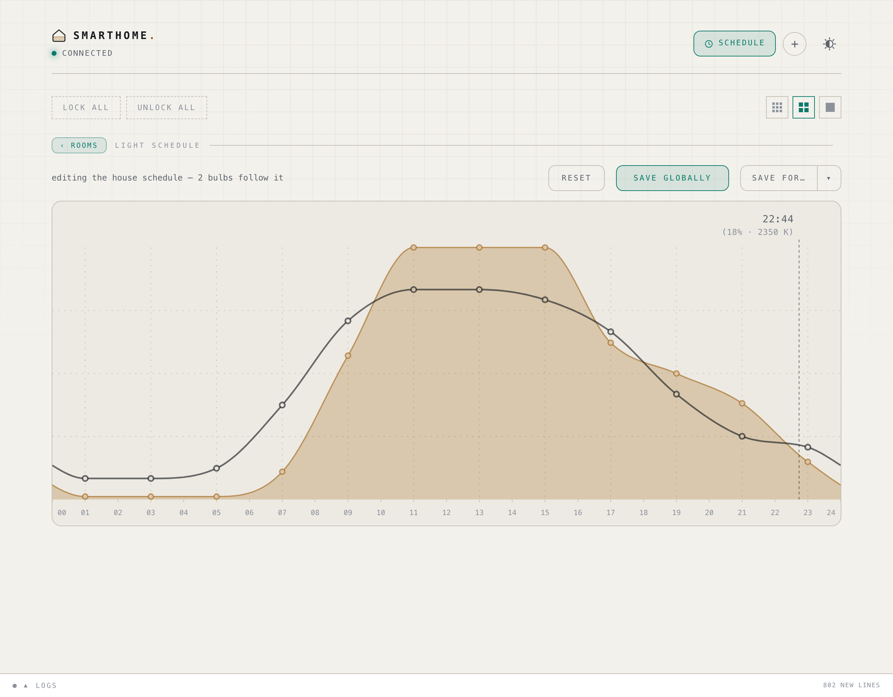
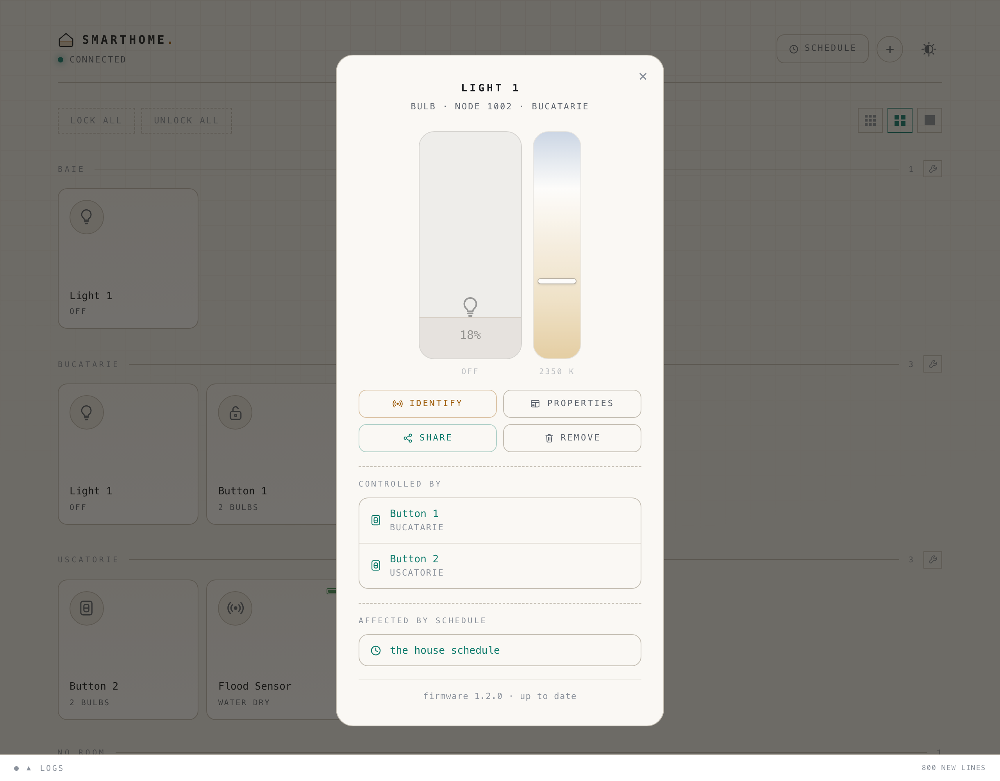
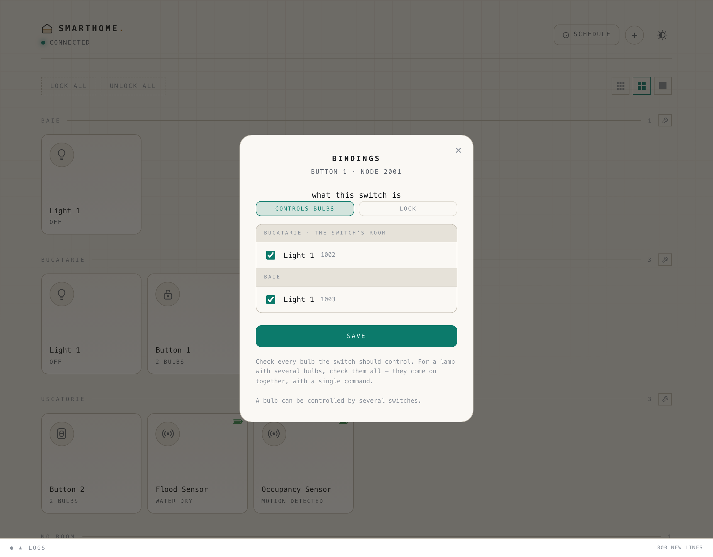
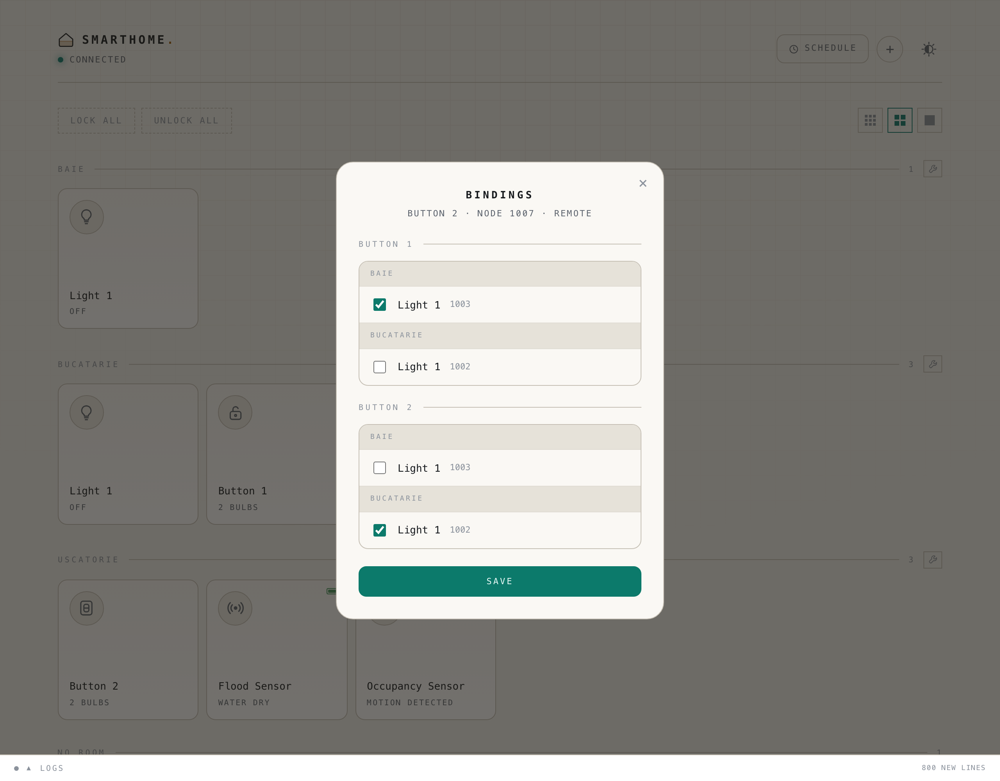

# smarthome — a Matter switch on nRF54L15 driving IKEA bulbs directly

Firmware for the Holyiot nRF54L15 module (BLE beacon + 3-axis accelerometer),
reflashed as a **Matter switch accessory** that drives IKEA Matter bulbs
**directly over Thread**, with no hub in the command path — plus a small web
panel on a small Linux box to administer it all.



## The panel

A section per room, a tile per device. The round icon is the quick action —
on/off for a bulb, lock/unlock for a switch — and anywhere else opens it, the
way Apple Home does: the tile grows into its page and shrinks back into its own
gap when you close it. The page is the device and nothing else. For a lamp that
is its brightness and a row of colours: **adaptive** first, which follows the
schedule, then a few whites, the colours if the lamp has them, and last a picker
for anything else. Identifying it, sharing it, its firmware and removing it are
one tap away, behind the gear. The settings and the picker come up from the
bottom as a sheet over the card, which sinks back behind them; drag the sheet
down, or throw it, and it goes. A battery gauge and a small cloud appear in a tile's corner when they apply: one
for the devices that run on a cell, one when firmware is waiting. A red crossed
signal takes that corner when a device has stopped answering — the last reading
stays on the tile, so you can see what its battery was on the way out.

The header counts what is answering out of what exists, and while anything is
missing the same crossed signal appears beside the count. Press the line — the
count and the mark together — and the page is only the devices wearing it.

**Brightness and colour follow the time of day.** The curve is yours to edit:
drag a point, then save it for the whole house or for one lamp.

**A camera can make a lamp answer.** A webhook is a tile like any other. Its
page is its address — marked POST, with a copy button — and a **test** button
that calls it the way a camera would; everything else is in its settings: a
name, a room, what it does, for how long, to what and to which lamps, saved as
you change them. POST to it — a camera that has seen movement, most likely —
and those lamps do what it says for as long as it says, then go back to exactly
what they were.

Not off, because at the hour this matters a lamp is usually already on and
dimmed, and a deterrent that ends with the room dark has made the house look
less lived in than before it fired. What to put back is read from each lamp at
the moment it fires rather than remembered: the panel's copy can be hours old
for a device that has gone quiet, and this is the one value that must not be
wrong.

Each one says what it does, for how long, and to what: **turn on** or **turn
off**; 5s, 15s, 1m, 5m, 15m or **always**; and — through the same control a
bulb's own sheet uses — the brightness and the colour it turns them to, or
adaptive, which leaves the colour to the schedule. The control follows the lamps
you tick: a list with one colour bulb in it gets the colours and the wheel, and
the white strip travels only as far as the narrowest of them can actually
go. A span puts every lamp back exactly as it
was afterwards; always leaves them where it put them — and when that is on, it
takes a hold, the same one a long press on a wall switch takes, or the schedule
would pull the light back to the curve inside a minute. Turning them off needs
no hold, because the schedule never turns a lamp on.

Off is not there for symmetry. A camera that sees you leave, or a hallway at
night where the useful answer to somebody walking through is the opposite of a
floodlight.

Add as many as you have cameras; each gets an id of its own, so one cannot
reach another's lamps. Bursts extend the span rather than stacking, so ten
events in ten seconds end where one would have. It answers in about a tenth
of a second and does the lamps on a thread of its own, because a camera wants
its POST answered now. No credential: every other route here is open to the
house network, so a secret on this one would protect nothing that `/api/light`
does not already hand over by a shorter path.

It is shaped like a bought remote, deliberately — a thing that is pressed from
outside, whose targets live in `devices.json` because there is nowhere in the
device to put them, and which the hub acts on. Same storage, same bulb picker,
same bargain: it does nothing while the hub is down.



**Every device says what it is part of.** A bulb shows which switches drive it,
which schedule it follows, and what firmware it is on.



**Switches are wired to bulbs here.** Tick what each one drives; the panel
writes the binding table and the ACLs that go with it.



**A bought remote gets the same editor**, one list per button. It cannot be
wired to a bulb the way our own switch can — a remote like IKEA's BILRESA
reports that it was pressed and nothing more — so the hub is what acts on it,
and it goes quiet whenever the hub does.



## How "direct" works

Not by running a controller on the module — that would need certificates, CASE
and mDNS, and it does not fit in 1.5 MB. It uses Matter's standard **binding**:

```
[button/accel] -> nRF54L15 module ---- Thread unicast ----> IKEA bulb
   the hub / border router is NOT in the command path
```

1. The module is commissioned as a Matter accessory (OnOff + LevelControl client)
2. An admin writes the **binding** table into the module → bulb node ID + endpoint
3. The bulb gets an **ACL** entry for the module's node ID
4. The module opens a CASE session straight to the bulb and sends commands

A press reaches the bulb with the hub switched off. The **schedule**
does need the hub, which writes into each bulb what it should come on to for the
current part of the day; with the hub down, a press still turns the light on, at
the last value the bulb was given rather than the one for the time of day.

**Apple Home, Google Home and DIRIGERA do not expose binding-table or ACL
editing**, which is why steps 2–3 happen in the panel here and you administer the
primary fabric yourself. You can add Apple or Google later as secondary admins
through multi-admin.

BLE is used exactly once, to commission the module. IKEA bulbs do not accept
commands over BLE at all — for them it is only a commissioning transport.

## What runs where

| | Where | What it does |
|---|---|---|
| the switch | on the wall, CR2032 | sends `Toggle` (and full brightness on a long press) straight to its bound bulbs |
| border router | Pi + nRF52840 dongle | the bridge to Thread |
| [matter-server](https://github.com/home-assistant-libs/python-matter-server) | Pi | the Matter client: commands, subscriptions, commissioning |
| [the panel](panel/) | Pi | the interface, the schedule, bindings, ACLs, rooms |

The panel speaks Matter through python-matter-server. Despite the package name
nothing here involves Home Assistant — it is a daemon with a WebSocket API.

Every hop is a **push**: a device reports an attribute the moment it changes,
matter-server holds subscriptions to all of them, and the browser sits on a long
poll that is answered the instant something moves. So a wall-switch press — which
the hub is not part of — shows up on screen in about 0.2 s. Reads are free, served
from matter-server's cache rather than by waking a sleeping device.

Idle, on a Pi 3 B+: matter-server 0.2% CPU / 153 MB, the panel 0.4% / 34 MB.

Firmware updates go the same way: matter-server serves the image, the panel
starts each one and watches it land — see [`ota/`](ota/).

## What the firmware does

| Requirement | Where | How |
|---|---|---|
| on/off straight to the bulb | `src/light_ctrl.cpp` | `OnOff::Toggle`, unicast through the binding table |
| brightness by time of day | `panel/server.py` | the hub writes `OnLevel` and colour temperature into the bulbs on every slot change |
| state after a power cut | `src/automation.cpp` | writes `StartUpOnOff` + `StartUpCurrentLevel` into the bulb |
| full brightness on demand | `src/automation.cpp` | long press = 254 + 4000 K, once |
| editable schedule | [`panel/`](panel/) | graphical editor, stored on the hub |
| the correct time | the hub | the switch has no clock; the hub knows local time, time zone and DST |
| firmware updates without wires | [`ota/`](ota/) | Matter OTA, served by matter-server, started from the panel |
| which bulb is which, what a switch drives | [`panel/`](panel/) | Identify + binding table |
| locking the switches | `src/lock_cluster.cpp` | our own cluster on dynamic endpoint 2 |
| the status LED | `src/status_led.cpp` | blinks only while waiting to be commissioned; dark otherwise |
| everything on the hub, no laptop | [`deploy/`](deploy/) | systemd units |
| which devices are known to work | [`docs/devices.md`](docs/devices.md) | every device commissioned here, with what worked |

### Who decides brightness

**The hub.** On every slot change — seven times a day — it writes two
persistent attributes into each bulb:

| attribute | what it does |
|---|---|
| `OnLevel` (LevelControl) | the level the bulb comes on to in response to `On` |
| colour temperature | written with `ExecuteIfOff`, so it applies while the bulb is off |

The switch sends nothing but `Toggle`; the bulb already knows the rest. Verified
on hardware: with the bulb off, write 454 mireds and `OnLevel` 200, and `Toggle`
brings it on at exactly 454 and 200.

This keeps the switch stateless, which is the point. A switch that decided the
level would have to remember whether the bulb was on — an assumption that goes
stale the moment the light is turned on from anywhere else, after which a press
appears to do nothing and you have to press twice.

The write happens **only on a slot change**, never periodically: `OnLevel` is
persistent in the bulb, and writing it every few minutes would be over 100,000
writes a year into its memory for an identical result.

`MoveToLevelWithOnOff`, not `On` + `MoveToLevel`: with two separate commands the
bulb comes on at the old brightness and only then moves, which reads as a flash.

## Locking the switches

A child playing with light switches is a good enough reason to be able to disable
them without taking them off the wall. Both pieces of state — locked, and the
role — live **in the switch**, in non-volatile memory: lock them, cut the power,
and they do not unlock themselves when it comes back.

A locked switch can still turn a light **off**, and can never turn one on. That
is the direction the lock is for: a child cannot put the lights on, and anybody
can still put one out without walking to the panel.

It does not blink, either way. Press it with the light already off and nothing
whatever happens, which is what keeps a locked switch from becoming a toy; when
something does happen, the room going dark says so.

Two ways to do it, and they work together:

- **From the panel** — a lock toggle on every switch, plus lock/unlock all. The
  panel reads the value back after writing it, because a confirmed write does not
  guarantee the value landed, and believing you locked when you did not is an
  expensive mistake.
- **With a dedicated switch** — any module can be given the **lock role**: it
  stops driving bulbs and instead sends its lock state to every switch in its
  binding table. The role is runtime state, not a separate firmware, so the same
  binary runs everywhere and the panel decides which module does what.

  It sends the **value**, not a toggle, so a switch that misses one command is
  resynchronised by the next press instead of being inverted for ever. A lock
  switch cannot lock itself and does not appear in its own target list — you would
  have no way to unlock the rest from the wall.

  It also writes its targets itself, three at a time and with three goes at
  each, rather than handing the table to Matter's `BindingManager` — which gives
  up on everything after the first target it cannot open a session to. A lock
  has as many targets as the house has switches, so it ran out of room partway
  down its own table and the last switches on it were never told anything. See
  [`docs/notes.md`](docs/notes.md#a-lock-reaches-every-switch-it-is-bound-to).

  And the panel finishes the job. The lock reports its own state when pressed;
  the panel hears that, waits a few seconds for the switch's own writes to land,
  and writes the same value to any target that still disagrees — reading it back,
  as it always does. A switch that was asleep with a flat cell catches up the
  moment it can be reached. Which also means locking the lock itself from the
  panel locks the house: its state *is* the house's state.

In Matter terms a lock switch writes an attribute on endpoint 2 of the others, so
its targets need an ACL entry with Manage privilege. The panel writes it when you
save a lock's bindings.

### The switch shows no actions in Apple Home

On purpose. The firmware has no `Switch` cluster (0x003B), so it exposes no press
events and there is nothing to automate on top of it. It drives the bulb directly
through the binding, and that is all — which is why it works with the HomePod
unplugged. The bulbs behave normally in Apple Home; only the switch is not a
source of automations there.

If you want the opposite (single/double/long press as triggers), add a Generic
Switch endpoint (device type 0x000F). That changes the endpoint composition, so
it has to be done before the first commissioning.

## Hardware

| | Pin | Notes |
|---|---|---|
| RGB LED — red | P2.09 | active low, confirmed on the board |
| RGB LED — green | P1.10 | active low, confirmed on the board |
| RGB LED — blue | P2.07 | active low, confirmed on the board |
| Physical button | P1.13 | active low + pull-up |
| UART TX / RX | P1.04 / P1.05 | `uart20`, declared; the driver is off |
| Accelerometer | LIS2DH on SPI00 | IRQ P2.00 / P2.03 — powered down |

The modules have no USB — flashing is over SWD, with a Raspberry Pi Pico or a
J-Link. Board definitions, LED behaviour, battery figures and the flashing
recipe are in [`docs/notes.md`](docs/notes.md).

## Installing it

Two halves, and they go in either order: the switch firmware, built on your own
machine and flashed over SWD, and the hub that runs the border router, the
Matter controller and the panel.

### What you need

| | |
|---|---|
| the switch | a Holyiot 25008 module (nRF54L15) and something that speaks SWD. A Raspberry Pi Pico or a XIAO RP2040 with `debugprobe` does the job; the module has no USB. |
| the hub | any 64-bit Debian machine with a free USB port, and an nRF52840 dongle for the Thread radio. A Raspberry Pi does it; so does a corner of a machine that already has a job. On a Pi, give it a supply that can hold 5 V under load — a sagging one browns out the radio, and it looks like everything else. |
| the lights | IKEA Matter bulbs. |

### 1. The switch

```bash
./scripts/bootstrap.sh              # the toolchain, once
./scripts/build.sh holyiot_25008
./scripts/flash.sh holyiot_25008
```

Pin map, LED behaviour, battery figures and the flashing recipe — including
which pad is which on each programmer — are in
[`docs/notes.md`](docs/notes.md).

### 2. The hub

Border router, matter-server, the panel and the systemd units that keep them up:
[`deploy/README.md`](deploy/README.md) walks through it end to end.

### 3. Then, from the panel

Open `http://smarthome.local` — http, and no port; [`deploy/README.md`](deploy/README.md)
says why the port matters on a phone.

1. **Add the bulbs.** The pairing code is on the box or the bulb itself.
2. **Add the switch.** No code to type — it is ours, and the panel knows its
   passcode.
3. **Tick which bulbs each switch drives**, and the panel writes the binding
   table and the ACLs.

There are two layers here that are easy to confuse: the
**Thread network** decides who can reach whom, the **Matter fabric** decides who
is allowed to command. The switch and the bulb have to share both, and a Matter
device cannot be moved to a different Thread network without a factory reset.

### Two ways to live with IKEA

**Stay on the IKEA network.** Add the switch in the IKEA app over BLE, then share
each device into this fabric as well. Nothing is reset and no bulb has to be
touched. It depends on the IKEA app offering sharing to another Matter ecosystem,
and on being able to reach the DIRIGERA's Thread network over IPv6.

**Run your own Thread network.** An OpenThread Border Router (Raspberry Pi +
nRF52840 dongle) and one factory reset per bulb, once. After that you own the
Thread dataset, the fabric and the node IDs, and the IPv6 routing is yours, so
commissioning, binding and OTA all work.

The reset does not necessarily mean handling the bulb — removing the last fabric
triggers a factory reset, so it is usually done from the IKEA app. Recommissioning
a factory-new device does go over BLE, so you have to be in the same room, but
not touch it.

This is not a dead end: as an admin you can open a commissioning window at any
time and invite Apple Home, Home Assistant or IKEA back in.

### Back up `ota/state/`

```bash
./scripts/commission.sh backup
```

It holds the fabric's CA key and the node IDs. Lose it and you can neither remove
the fabric from a bulb nor open a commissioning window — the only way out is a
physical reset of every device. It is the one thing here that genuinely hurts to
lose, so keep the archive off the machine.

## Things you may want to change

The defaults are the Matter sample's test values. They are fine on your own
fabric; they are worth changing if you are handing the firmware to anyone else.

- **Matter credentials** — VID `0xFFF1` / PID `0x8004`, compiled in
  (`CONFIG_CHIP_FACTORY_DATA=n`). The `factory_data` partition is already reserved
  in the map.
- **Passcode and discriminator** — `20202021` / `3840`, in plain sight in
  `ota/config.sh`.
- **The custom cluster ID** — `0xFFF1FC30` on endpoint 2 is in the test vendor
  space. Changing it means changing **all three** places that have to agree:
  `firmware/src/lock_cluster.cpp`, `firmware/src/light_ctrl.cpp`
  (`kSmartHomeCluster`) and `panel/server.py` (`SCHED_CLUSTER`).
- **`CONFIG_SMARTHOME_LED_TRIM_*`** — calibrate on your own module, or the amber
  used by Identify will not match the one in the interface.
- **Anti-rollback**, if you want it. Without it, anyone with fabric access can
  push a validly signed old version. It uses MCUboot security counters, which
  write to OTP — irreversible.
- **Back up `ota/keys/mcuboot-signing.pem`** off the machine. Lose it after
  flashing and you can no longer ship OTA updates.

## What is not verified

- **Hardware testing is partial.** Verified on the board: the LED channels and
  colours, the accelerometer power-down, the switch booting into a fabric and
  signalling with the LED, lock/unlock through the custom cluster, and the hub
  writing `OnLevel` + colour temperature with `Toggle` then lighting the bulb at
  exactly those values. Not verified: a physical press reaching a bulb through the
  binding, the periodic startup-state writes, the accelerometer gestures.
- **Endpoint 2 in Apple Home.** It carries a device type no ecosystem knows, so it
  should be ignored, but this has not been seen on a real phone. If it does show
  up, move the lock attributes to endpoint 1 (requires regenerating app-common,
  see `docs/zap.md`).
- **`scripts/commission.sh`** was written from documentation. Devices have been
  commissioned, but from the panel.
- **The OTA flow.** The firmware side is verified — partition map, signed image,
  generated `matter.ota`; the host side needs hardware and a Thread network. See
  [`ota/README.md`](ota/README.md).

## Where the detail lives

| | |
|---|---|
| [`panel/README.md`](panel/README.md) | the panel: architecture, the schedule, the interface |
| [`deploy/README.md`](deploy/README.md) | putting it on the hub, and moving it to another one |
| [`docs/devices.md`](docs/devices.md) | devices this has actually been used with |
| [`docs/notes.md`](docs/notes.md) | battery, the LED, board definitions, flashing, toolchain |
| [`ota/README.md`](ota/README.md) | firmware updates over the air |

## Licensing

**This project's own code is Apache-2.0** — see `LICENSE`. The Matter SDK and
Zephyr are both Apache-2.0, so the whole portable stack sits under one licence.

`firmware/` also contains files derived from the nRF Connect SDK's
`matter/light_switch` sample. They keep their
`SPDX-License-Identifier: LicenseRef-Nordic-5-Clause` headers, full text in
`LICENSE.nordic`. **Read clause 4 before you plan a port:**

> This software, with or without modification, must only be used with a Nordic
> Semiconductor ASA integrated circuit.

That is a field-of-use restriction: those files are not open source in the OSI
sense and cannot be used on an ESP32-C6 or any other non-Nordic radio.

### What that costs you

Less than it sounds, because the restriction lands on the shell rather than the
substance:

| | lines | licence |
|---|---|---|
| `light_ctrl`, `automation`, `status_led`, `lock_cluster`, `lock_state` | 1691 | Apache-2.0 (ours) |
| `light_switch.matter` — the data model | 2198 | Apache-2.0 (ours) |
| `main.cpp`, `app_task.{h,cpp}`, `chip_project_config.h` | 367 | Nordic 5-Clause |
| build config: `CMakeLists.txt`, `Kconfig*`, `prj.conf`, `sysbuild.conf` | — | Nordic 5-Clause |

The logic uses **no Nordic-specific API at all** — no `nrfx_`, no `nrf_`, no
`hal/nrf`. It reaches for Matter (`app/`, `controller/`, `platform/`) and Zephyr
(`drivers/pwm.h`, `drivers/sensor.h`, `kernel.h`), both Apache-2.0.

So the Nordic-licensed part is precisely what a port throws away anyway: an
ESP-IDF Matter application brings its own entry point, task skeleton and build
system. Take the 3889 lines above, write your own shell around them, and nothing
you ship is touched by clause 4.

### Third-party components

| what | where | licence |
|---|---|---|
| nRF Connect SDK sample (shell + build config) | `firmware/` (19 files) | LicenseRef-Nordic-5-Clause |
| Project CHIP / Matter SDK (ZAP-generated) | `firmware/src/default_zap/`, `firmware/snippets/` | Apache-2.0 |
| everything else | `panel/`, `deploy/`, `scripts/`, the rest of `firmware/src/` | Apache-2.0 |

The board definitions under `firmware/boards/holyiot/` are ours.

*Not legal advice — read `LICENSE.nordic` yourself before redistributing.*
